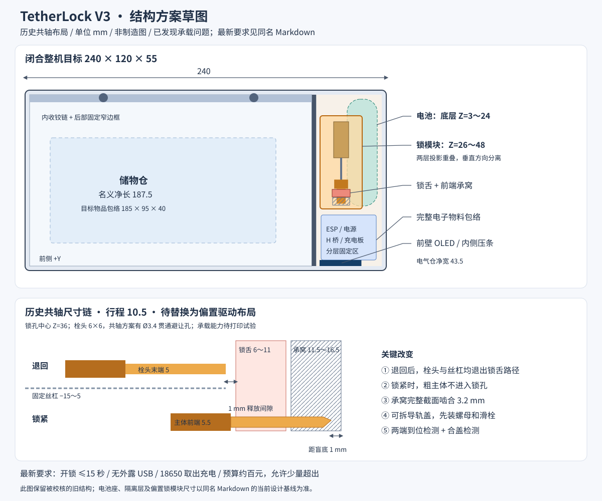

# TetherLock V3 结构方案草稿

2026-10-01 · **结构方案草稿，不是已验证制造图**。

**CAD 更新**：已生成 [V3 结构样机](v3-cad.md) 与 [总装源文件](../../cad/v3/assembly.scad)。实际模型采用偏置丝杠、浮动拨指、实心栓；行程更新为14 mm，前支撑移到Y=14.8以避开开盖轨迹。本文先前10.5 mm共轴尺寸和原预算表为讨论记录，当前尺寸、物料与证据以V3 CAD说明为准。

## 当前设计基线（用户确认后更新）

以下要求取代本文旧的 USB、充电板、严格百元和未确认手机目标；后文共轴尺寸保留为历史校核对象。

| 项目 | 当前要求 |
|---|---|
| 外形 | 尽量维持闭合整机 240×120×55 mm，包含盖与铰链 |
| 驱动 | 采用方案 A，优先评估偏置丝杠/浮动螺母驱动实心插销 |
| 开锁时间 | 从有效开锁命令到退回到位确认 **≤15 秒**；不包含设定的锁定倒计时 |
| USB | 取消外露 USB 供电/充电接口，不预留外壳 USB 开孔 |
| 补电 | **取出 18650，用独立充电器充电**；取消盒内充电板及充电电源路径 |
| 收纳对象 | 按市场上大尺寸 iPhone 的收纳状态设计，并留保护壳、相机凸起和取放余量 |
| 储物验收包络 | 保留 **185×95×40 mm** 设计目标；检查实际净空与放取路径，不仅比较裸机尺寸 |
| 预算 | 约百元，允许少量超出；目前只做完整物料及预算分配，具体售价由用户后续核实 |

### 手机尺寸依据

核验日期 2026-10-01。Apple 当前公开的 iPhone 18 Pro Max 机身为 **163.4×78.0×8.75 mm**，见 [Apple 中国大陆技术规格](https://www.apple.com.cn/iphone-18-pro/specs/)。这是机身规格，不能当作已含相机凸起、保护壳或指环支架的完整实体包络。

Apple 同时公开 iPhone Duo：合拢为 **117.8×84.1×11.3 mm**，展开为 **164.6×117.8×5.2 mm**，见 [Apple iPhone Duo 技术规格](https://www.apple.com/iphone-duo/specs/)。本设计暂按**折叠机合拢收纳**理解“最大 iPhone”；展开状态不在该 95 mm 宽目标内。这样既覆盖 Pro Max 的长度，也考虑折叠机合拢后的较大宽度，不能仅把 Pro Max 裸机称为所有维度都最大的 iPhone。

185×95×40 是我们的设计留量，不是 Apple 官方带壳尺寸；只承诺最终检查这个物品包络的放取路径，不能保证任意超厚壳或附件都适配。两款收纳状态裸机均落在此目标内，整机 CAD 尚需复核内衬、铰链、螺钉和取物避让。

### 15 秒如何影响电机选型

在原 10.5 mm 行程、单头 M3×0.5 的条件下，21 转需 `1260/rpm` 秒。**84 rpm 只是恰好 15 秒的理想下限**，没有给加速、反向间隙和检测停机留余量。优先考察实际最低工作端电压及指定移动负载下仍达到约 110～150 rpm 的候选，再实测 ≤15 秒。商品标称空载转速不能代替这个测试。

原查到的短轴 40 rpm 电机仍不合适；不能因为等待时间放宽就直接选用。偏置驱动允许把较长丝杠放在锁舌旁边，可能免去截短，但实际可用牙区间、螺母运动、轴端避让和输出轴允许载荷仍需建模/实測。取消 USB 不改变到位检测、限流、超时停机的要求。

### 电池维护与故障取物

电池仓需能在手机主盖锁住时取出/装回电池，维护入口与锁机构之间设固定隔壁/顶板，不能从换电孔直接拨动插销。由此电池固定要改用可拆电池座或带防反接接插件的电池组件，不能继续沿用必须拆整盒才可移除的点焊固定方案。

暂预留电池组件区 **X=92～116、Y=−54～23、Z=3～25（24×77×22 mm）**，替代旧 20 mm 宽区。该空间是含电池座、触点/保护和取出余量的待核验包络，具体现货未冻结。其上隔离层拟 Z=26～29；偏置驱动模块拟 X=76～112、Y=−43～23、Z=29～48。维护盖、紧固件和接插件必须进入总装，不能只增加一个底部开口。

低电量时禁止开始新的锁定，并验证保留一次解锁能量。换电或复位不能把已有锁定任务自动清零；持久化状态及掉电后计时行为需在控制设计中明确。可更换机械释放件继续作为故障取物候选，断裂力度尚未标定，不能把这次取消 USB 理解为已经批准某个破坏力数值。

供电改为受保护的 1S 电池分别供电机驱动支路和主控 3.3 V 支路。开发板已有 USB 可仅用于拆开后的调试，不引到外壳；无需设置充电板、充电接口或边充边用电源路径。电机电压适配、低电压启动能力及主控瞬态列为当前采购适配说明中的待测项。

### 更新后的预算分配

仅为设计额度；当前不据网上售价冻结采购。打印材料、运输、工具和多次试验耗材单独列账，最终采购总额由用户核实。

| 完整类别 | 暂定额度（元） |
|---|---:|
| ESP32-C3 | 10 |
| OLED | 8 |
| 丝杠电机 | 20 |
| 18650、保护、电池座/可拆连接 | 18 |
| 电机及主控稳压 | 12 |
| 可限流 H 桥、到位/合盖检测、按键 | 12 |
| 五金、销轴、亚克力、电池维护盖固定件 | 8 |
| 线束、接插件、辅助元件 | 8 |
| 分配小计 | **96** |
| 原型余量 | **10** |
| 分配目标 | **106** |

允许少量超出不等于承诺 106 元可以买齐。已取消的充电板不计入新版分配；独立充电器如需新购应单列。后文 90+10 及 USB 电源路径是旧讨论记录，不是当前要求。

---

## 原草稿与共轴校核记录

**A 方案更新**：局部理想运动检查成立，但共轴草稿存在「丝杠先于导轨/承窝接触」的承载反例；短轴电机选型、供电和百元采购尚未通过。下文共轴尺寸仅保留为被检查的草稿，不能直接用于制造。当前基线采用偏置螺母驱动实心插销，具体限制以 V3 CAD 和采购适配说明为准。

本段坐标是方案评审和后续建模时的尺寸分配，不是当前模型的测量结果。用户约束是：**尽量维持 240×120×55 mm，物料控制在百元内**。

## 1. 方案选择

| 方案 | 好处 | 代价/未决点 | 建议 |
|---|---|---|---|
| A：N20 丝杠 + 可拆导向盒 + 位置检测 | 延续现有采购方向；闭锁载荷由支承承担，电机用于移动插销；可单独打印、调试和更换锁机构 | 必须确定丝杠电机实际 SKU、螺距、长度与低电压性能；有螺母和导向摩擦 | **推荐的 V3 原型方案** |
| B：MG90S + 凸轮推动滑栓 + 独立机械止挡 | 使用常见舵机；不需要丝杠螺母配合 | 多一个联动和止挡，仍需验证反驱；需要舵盘接口和供电余量 | A 买不到合适电机时的备选，不能直接恢复旧 V2 舵机 CAD |
| C：采购完整小型电子锁模块 | 减少自制传动件 | 当前没有经过尺寸、供电、价格核验的模块；可能挤占储物空间或预算 | 暂不作为本轮基线 |

## 2. 外形与空间

把 **240×120×55 定义为闭合整机包围盒**，包括顶盖和铰链；V2 当前后突铰链和顶盖使真实包围盒达到 240×129×59.5，不能继续把底盒尺寸当整机尺寸。

- 外壳暂用 3 mm 底厚/壁厚；底盒分型面 Z=51，盖厚 4 mm，闭合顶面 Z=55。
- 隔板中心 X=72，厚 3：储物 X=−117～70.5；电气 X=73.5～117，净宽 **43.5 mm**。储物名义净长 **187.5 mm**，比 V2 小 10.9 mm。局部铰链、圆角和内衬会减少可用区域。
- 优先保证一个 **185×95×40 mm 物品包络**的放入/取出路径。这个包络是设计目标，用户实际手机含保护壳还需核对。
- 电池沿 Y 放在电气仓底层，预留 X=94～114、Y=−54～17、Z=3～24 的安装区，覆盖电芯、点焊线和独立保护件/线束的局部空间；采用真正贯通的穿带桥或螺钉压条。
- 锁机构放在电池上方，预留 X=76～104、Y=−43～19、Z=26～48。支架下缘和电池安装区之间至少 2 mm；不得让紧固件或接线进入电芯包络。
- ESP、电源、H 桥和充电板位于前部 Y=23～53，利用 Z 分层；OLED 固定在前壁。每块板必须单独建模，装配高度由实际板上最高器件和接插件推导，不能用“一块电源小板”代替几块现货模块。
- 后部采用内收铰链和固定窄边框，铰链原型轴心拟 Y=−55、Z=51，节套 OD≤8；移动盖板的后缘不越过轴心向后延伸。固定边框与交错节套需要在 CAD 中做扫掠避让，最终以闭合包围盒和开盖路径复核。

此布局牺牲少量储物长度，换取完整的电子固定区和锁机构装配空间。保持外尺寸同时增加仓内净空，需要改隔板和分层，不能只改几个旧参数。

## 3. 锁机构：先把尺寸链算对

拟采用共轴丝杠/滑栓，保留 6×6 mm 栓头。共轴方案必须给栓头留 Ø3.4 丝杠避让孔，因此**栓头为空心，不能称为实心**；承载能力靠样件试验决定。若它不能满足标定载荷，再比较偏置丝杠或金属插销，不能套用“>150 kgf”。

以下沿 Y，锁栓轴高拟 Z=36，轴 X 拟 90。滑栓主体长 6，栓头长 10，含前端 0.8 mm 导入段；主体横截面先按 9.2×9.2 配置，导向净空单边 0.3 mm 起步，打印样条校准后再冻结。

| 特征 | 退回端 | 锁紧端 | 要验证的关系 |
|---|---|---|---|
| 电机齿轮箱前端 | Y=−15 | 不动 | 本体/焊片向 −Y 放置，型号尺寸由实测确定 |
| 有效丝杠段 | Y=−15～5（20 mm） | 不动 | 丝杠端 **5 < 锁舌后表面 6**，固定丝杠不挡开盖 |
| 滑栓后端 | Y=−11 | Y=−0.5 | 总行程 **10.5 mm**，避免 V2 的退回仍锁住 |
| 主体前端 | Y=−5 | Y=5.5 | 锁紧时主体在锁舌后表面之前 **0.5 mm**，不得进入锁孔 |
| 栓头端点 | Y=5 | Y=15.5 | 退回端距锁舌后表面 **1 mm**；锁紧端距承窝盲底 **1 mm** |
| 螺母位置（相对滑栓后端 +2，厚 2.6） | Y=−9～−6.4 | Y=1.5～4.1 | 全程处于丝杠有效段内；锁紧端距丝杠末端至少 **0.9 mm** |
| 盖上锁舌厚度 | Y=6～11 | 不动 | 5 mm 厚，孔 6.8×6.8；公差包含打印和合盖重复定位 |
| 前端承窝 | Y=11.5～16.5 | 不动 | 全截面栓头截至 Y=14.7，承窝中完整承载段 **3.2 mm**，导入斜面另算 |

**关键验收**：退回端检查锁栓和固定丝杠与锁舌连续扫掠包络；锁紧端检查主体不进入锁孔、栓头不顶盲底、前后支承实际接触长度。螺母只预留 0.9 mm 端部余量的部分尤其需要把螺纹退刀槽和未完整牙长度纳入物料测量；如不够，调整电机位置/丝杠长度，同时保持末端不进入锁舌路径。

`M3×20` 为**物料需求**，不是声称所有 N20 都带这种轴。厂商资料中常见 N20 类减速电机为 10×12 截面、3 mm D 形输出轴，不能拿这种图纸证明定制丝杠轴的长度、额定电压或扭矩。[Pololu 尺寸资料](https://www.pololu.com/category/60/micro-metal-gearmotors)

## 4. 装配和易损件

- 锁机构为底座 + 可拆导轨盖 + 电机压条。先放螺母和滑栓，再装电机、导轨盖和传感器，最后把模块从上方固定到箱体。导槽不做一体封闭隧道。
- 螺母槽从装配侧完全开放，闭合后由盖板保留；螺母的插入姿态和路径作为 CAD 检查状态。
- 锁舌上端改 **T 形头 + 盖内螺钉压板**。头部承力在盖内肩台，颈部通过开放通道伸出；压板只在开盖后可访问。首版允许用工具更换，暂不承诺 1 秒无工具更换。
- 锁孔顶面拟 Z=39.4，弱颈区域拟 Z=41～43，保证开孔与弱颈切除之间至少 1.6 mm；头部拟 Z=47～50。弱颈初始用三个不同截面的样件标定，切除体沿既定方向显式挤出，禁止靠叠加旋转猜结果。
- 强度目标在试验后冻结；先满足日常开合、误拉和故障释放的试验，再判断锁舌、盖座、铰链、螺钉哪个先坏。
- 销轴/端部限位采用盒内可访问的固定结构；销长、节套跨度、端部压板和轴向间隙全部进 BOM 和总装。首版手动开盖，取消未实现的硅胶助力带。
- 亚克力从盖内安装，由连续肩台和内侧压条固定。压条有明确连接和紧固孔，不依赖外露点胶维持防拆目标。

## 5. 检测与电源

预留三种实际输入：合盖检测、插销退回到位、插销伸出到位。采用微动开关或磁传感器的具体型号需要完整包络与固定位；模型动画不算检测证据。

控制行为：合盖后才允许锁紧；伸出/退回分别由到位信号停机；超时或堵转停止驱动并显示故障；退回确认后才能提示开盖。重新上电先判断位置，不自动把中间态当成锁紧。低电量时保留一次解锁能量的要求需要样机测试，不能由电芯容量直接推断。

电机支路候选为适配 1S 的 H 桥，DRV8833 可作为核验参考，其芯片工作范围 2.7～10.8 V、支持电流调节；模块板能承受的实际电流和散热还要单独验证。[TI DRV8833](https://www.ti.com/product/DRV8833)

供电需要独立的电池保护，以及能在外接电源下驱动系统的路径。可比较带电源路径的充电方案，或 TP4056 配明确的负载切换；不能把 TP4056 充电芯片本身当作完整电源路径管理器。BQ24074 是带电源路径功能的技术参考，是否采用现货模块由预算和板尺寸决定。[TI BQ24074](https://www.ti.com/product/BQ24074)

主控 3.3V 电源需覆盖电池电压范围和 Wi-Fi 瞬态；外接供电、开发板 USB 和电池路径必须核对反灌。V3 CAD 首版可使用保守模块包络验证布局，未选定的模块统一标为 **占位包络，未实测**，不能宣称生产可用。

## 6. 百元预算分配

以下是**设计预算额度，不是实时采购报价，也不保证现货总价**。沿用 V2 口径：不含打印件、运输、工具和多次试验耗材。

| 类别 | 额度（元） |
|---|---:|
| ESP32-C3 主控 | 10 |
| OLED | 8 |
| 确定型号的丝杠电机 | 15 |
| 电芯及保护 | 15 |
| 充电/电源路径/3.3V 电源 | 15 |
| H 桥、检测件、按键 | 10 |
| 五金、销轴、亚克力 | 8 |
| 线束、接插件、辅助元件 | 9 |
| 小计 | **90** |
| 预留 | **10** |

额度超出时先简化蜂鸣器、助力开盖和外观附件；位置检测和确定的供电路径不能为了看上去“百元内”从 BOM 中省略。

## 7. 后续 CAD 交付与验收

方案确认后，在独立 `cad/v3/` 中建模，不覆盖 V2。交付：参数化 OpenSCAD 源码、总装和爆炸图、分别适合打印放置的 STL、非打印硬件包络、二维关键尺寸图、装配说明、物料表和复算脚本。预览从同一导出模型和总装位置数据生成。

验收依次为：

1. 每个打印件闭合且为一个连通实体；组合打印盘例外必须显式列出各零件。
2. 所有必需物料进入 BOM 和总装；尺寸来源分成厂商图纸、实物测量和占位包络。
3. 总装闭合无非预期体积相交；安装、螺母插入、螺钉工具与接线有通道。
4. 退回/锁紧断言成立；开盖 0～至少 100° 做实体扫掠检查和实际样件验证。
5. 闭合整机包括铰链保持在 240×120×55 目标包围盒内；内腔目标包络能放入和取出。
6. 导出 STL 与源码同源；细分引起的差异单独处理；参数改变后检查仍能发现错误。
7. 先打印配合样条和小锁模块，再打印整盒。接着做开合循环、受拉开锁、断电保持、低电量、外接供电和牺牲件试验，明确记录失败。

需要确定的物料清单、控制接口和强度数据尚未冻结。**V3 可以先做可评审原型 CAD；制造放行需要选定物料测量及打印试验。**
