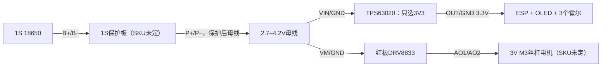

> 历史报告：下面M3/霍尔/旧店铺报价已被用户的新规格替代。当前采购和预算请看[最新核算报告](v3-procurement-current-2026-10-02.md)，不按以下旧情景下单。

# V3 样机模块、价格与运费公开资料核查报告 · 2026-10-02

范围：1套样机，外壳白色PETG；收货云南红河个旧或蒙自。按用户最新要求，仅通过公开资料继续核验，不再访问淘宝登录会话。先前六项淘宝SKU观察值显示寄**个旧**，本轮不重新验证，蒙自未单独验证。没有购物车、下单、支付或联系卖家。

这份报告核对整套BOM，不把资料核查等同实物验收。完整69行审计表保留每项数量、估算/已观察报价和适配限制；公开外币报价另列，未混入人民币总额。最终整套到手价仍未知，不能按条件估算直接下单。

## 结果与预算口径

保留同日较早已观察的六个具体商品/SKU报价，预算采用优惠前价格，保留平台补贴为参考。装机成本包含消耗的材料；整包采购包含买整卷和余量。所有金额为人民币。

| 项目 | 原预算 | 本次结果（不含运费） |
|---|---:|---:|
| 原配置装机估算 | 216.95 | 215.95，仅矫正主控与电池座报价 |
| 原配置整包采购 | 275.50 | 274.50 |
| 六项低价候选全部适配后的装机情景 | — | **109.73** |
| 六项低价候选全部适配后的整包采购情景 | — | **168.28** |
| 工具及外置充电器 | 178.00 | 仍为估算，已有工具可复用 |
| 外包打印 | 未报价 | 未报价，不按0元计算 |

条件情景较原估算减少**107.22元**；包含稳压板、驱动板、OLED和2500mAh电芯的替代，不能视为原CAD及原电路已适配。其余零件仍沿用旧估算，并非全部取得真实报价。预算尚未达到装机约100元目标。

六项商品优惠前合计**38.78元**，分别购买的商品页运费合计**8元**，该小计到手参考**46.78元**。四件育松商品若最终能合单只收2元，则六项小计为40.78元；**同店合并运费尚未核实**。按分别购买运费，整包情景168.28+8=176.28元，**还须加其他零件运费和可能的外包打印费**，不能标作完整到手价。

主表仍保留Pololu及SSD1306原配置；低价型号另列条件候选，防止把不同商品报价套到原零件。结构模型没有修改。最新完整逐项表见 [采购审计CSV](v3-procurement-audit-2026-10-02.csv)，机器可读报价见 [procurement-quotes.json](../../engineering/procurement-quotes.json)。

## 已查到的商品

| 原清单项目 | 确定商品规格与链接 | 优惠前 / 页面优惠价 | 寄个旧运费 | 实物资料与结论 |
|---|---|---:|---:|---|
| ESP32-C3 | [育松无排针版](https://item.taobao.com/item.htm?id=746684070257&skuId=5146935732020) | 10.50 / 6.50 | 2 | 商品文本18×22.52；Nologo参考图18×22.50mm。原CAD17.8×22.5，宽差0.2mm；总高、USB和焊线包络仍需测。 |
| OLED | [育松0.96寸白色IIC](https://item.taobao.com/item.htm?id=608307780108&skuId=4276111673863) | 7.50 / 3.50 | 2 | 卖家标1315，按SSD1315候选。PCB25.2×26，孔距21×21.8、孔径2mm；原27.8×27.3/SSD1306不能沿用。厚度、玻璃位置和驱动待核。 |
| 电池座 | [育松18650单节无盖](https://item.taobao.com/item.htm?id=608911086247&skuId=4277561585844) | 0.50 / 未扣券 | 2 | 未获得该规格完整尺寸图；装入电芯后整体须≤74×22×21mm，弹簧、端子与红黑线不能忽略。 |
| 驱动板 | [育松DRV8833红板](https://item.taobao.com/item.htm?id=613483776328) | 2.38 / 1.38 | 2 | 双8针、排针另附；尺寸未确认。引脚与Pololu不同，未引出FLT；芯片封装待核，不能直接按1.2A持续电流采用。 |
| 稳压板 | [成瑞黑色TPS63020，短接选3.3/4.2/5V](https://item.taobao.com/item.htm?id=854449832375&skuId=5822396794144) | 6.90 / 3.90 | 0 | **25×14.5×4.5mm**，端孔间22mm。原15×20×7.2包络长边少5mm，需适配。选输入1.8–5.5V款，避开同链接2035输入3–20V款。 |
| 电芯 | [锂电池超市亿纬25P平头2500mAh](https://item.taobao.com/item.htm?id=746205673995&skuId=5421654243887) | 11.00 / 8.00 | 0 | 厂家高65.00±0.15、直径18.35±0.10mm；容量比原2600mAh少约3.8%。预售5天，正品和整座包络待验。 |

这些是2026-10-02会话中商品页观察值，不是支付承诺。平台“加补”可能随账户、订单组合、支付方式变化；满2减1券不能对同店每件重复扣除，淘金币未扣。没有将单件优惠价简单累计为整套预算。

## 尺寸图与电路资料

保留公开图片及来源，未保存账户资料：

- 主控：[官方参考尺寸图](v3-procurement-evidence/esp-dimensions.png)、[官方参考原理图](v3-procurement-evidence/esp-schematic.png)，来源 [Nologo硬件仓库](https://github.com/NologoTech/ESP32C3-Supermini/tree/main/Hardware)。图中有USB电源二极管和ME6211稳压；淘宝无排针SKU是否同版尚未确认。商品文本22.52与图22.50的差异保留，不冒充实测精度。
- OLED：[卖家尺寸图](v3-procurement-evidence/oled-details.png)，[原始图片](https://img.alicdn.com/imgextra/i4/2928723973/O1CN012x81Vz1fDgBPtJ9N1_!!2928723973.png)。无该完整板级原理图，不能由SSD1306芯片手册证明SSD1315模块兼容。
- 驱动：[卖家接口说明](v3-procurement-evidence/drv8833-details.jpg)、[商品实拍](v3-procurement-evidence/drv8833-main.jpg)，[TI芯片数据手册](https://www.ti.com/lit/ds/symlink/drv8833.pdf)。实拍芯片丝印受水印/分辨率影响，封装未确认。PW每通道500mA RMS、PWP/RTY每通道1.5A RMS，峰值2A也不能当连续电流。尺寸不能借用其他18.5×16黑板。
- 稳压：[卖家尺寸/接口图](v3-procurement-evidence/power-1.jpg)、[使用条件](v3-procurement-evidence/power-2.jpg)，[TI数据手册及参考电路](https://www.ti.com/lit/ds/symlink/tps63020.pdf)。只短接3V3，不同时短接多个输出选择焊盘。芯片4A开关能力和商家最大3A均不等于低电池时可持续输出；实际模块的电感、散热及焊线仍需测试。
- 霍尔：[TI DRV5032手册](https://www.ti.com/lit/ds/symlink/drv5032.pdf)。ZE为20Hz、全极性、开漏、BOP最大63mT，供电1.65–5.5V；SOT-23(DBZ)脚1 VCC、2 OUT、3 GND。TO-92脚序不同，不能混用。原8×6及6×6mm是设计包络，未证明存在相同商品板。

## 低价候选的接线差异

下面仅为待核对候选连接，不能替代当前Pololu配置的 [electrical.json](../../engineering/electrical.json)。完整模块原理图不足之处，需要连通测量。

| 信号 | 红板候选连接 | 与旧电路的差别/验证条件 |
|---|---|---|
| GPIO7 / GPIO10 | AIN1 / AIN2 | 不接AO输出；00滑行、10/01反向、11刹车，方向台架确认 |
| 电机 | AO1 / AO2 | 仅用A通道，未用BIN1/2接地，BO1/2悬空 |
| STBY | 先测是否连芯片nSLEEP，再按需要拉到3.3V | 不继承Pololu默认上拉假设；TI nSLEEP高阈值2.5V，3.3V逻辑足够 |
| FLT | 未引出，NC保持不接 | 原FLT测试点不能直接沿用；若要故障检测应换有nFAULT引出的板或另设计 |
| 主控3V3 | 稳压OUT | 先量输出及核对板级USB路径；板上5V/VBUS焊盘不能直接当3V3入口 |
| OLED SDA/SCL | GPIO0 / GPIO1 | 扫描地址、核对3.3V上拉、实际1315驱动，不承诺原1306初始化兼容 |
| 霍尔OUT | GPIO3/4/5，各10k上拉3.3V | 每路100nF去耦；真实小板可能已带电阻/电容，避免重复采购 |

红板卖家图，按图示方向：左列自上而下NC/AIN2/AIN1/STBY/BIN1/BIN2/NC/GND；右列VM/NC/GND/AO1/AO2/BO2/BO1/GND。必须依据实物丝印和连通性确认方向。

## 尚未核得确定SKU的项目

| 项目 | 现状及采购条件 | 价格处理 |
|---|---|---|
| N20丝杠电机 | 原需求3V、M3×0.5、本体26×12×10、外伸33.6mm。新增驰海厂家尺寸/电气资料见下节；对应淘宝SKU及价格未定。找到[广华3V/200rpm/M3供货参考](https://shop.cpu.com.tw/product/58796/info/)，但杆55mm/总长81mm，不能直接套用。[拓竹LA005](https://asia.store.bambulab.com/products/n20-m3-threaded-shaft-reduction-gear-motor?variant=42123398381704)是6V额定、25mm杆、400rpm，也不是当前规格。低电池带载≥140rpm、14mm行程和启动/堵转/自锁均未验证。 | 18元保留估算；无匹配SKU和寄云南报价 |
| 霍尔小板×3 | 找到[立创C266118裸芯片](https://www.lcsc.com/product-detail/C266118.html)，先前会话页面曾显示5片起、USD0.2117/片，本轮公开静态页面未能再次读取价格；这不是完整小板，也不是国内到手价。缺小板、焊接和磁距验证。 | 原1元/片仍为估算，不能视作成品报价 |
| 外置充电器 | 单节4.2V锂离子完整充电器，充电电流匹配电芯；非裸TP4056板即完整充电器。 | 15元估算，真实商品及运费未知 |
| 保护板 | 必须1S，B+/B−电芯侧，P+/P−负载侧；P−为系统地，不能旁路。启动电流及切断恢复待测，不能用2S板或3.2V磷酸铁锂方案替代。DW01A欠压阈值可低至2.3V，与25P下限2.5V不匹配，原候选暂不采用。 | 2元/块、买2块仍估算 |
| 电池接头 | 原SH1.0成对包络及1A限额待核；原厂SH是线对板、端子支持AWG32–28，1A以AWG28为条件，不能直接压接26/24AWG线；电机堵转决定是否换接头；不能靠线色确认针位。 | 2元/对估算 |
| 按钮 | 原圆形Ø9×4、按钮Ø7无确定商品；常见6×6方形轻触或12mm面板钮不是同尺寸。 | 1元估算 |
| 100µF电容 | ≥10V低ESR，靠近驱动，含引线包络和极性待定，容量按瞬态测量决定。 | 0.5元/个估算 |

机械辅料和耗材逐项纳入CSV，没有取得的报价保持“估算”：M2螺钉按CAD数量；M2嵌件OD3.2×4mm，不能只搜M2就买；M3螺母对边5.5/厚2.4；Ø3×2轴向磁铁；Ø2×180钢销；149×82×1.5透明片；24–26AWG软线；绝缘、泡棉和胶。绑带槽仅1.5mm，常见2.5mm绑带不适配。白色PETG400g/整卷1kg50元是切片前估算，不是实际打印报价。

## 一套样机的省钱安排

1. 优先同店选主控、OLED、驱动、电池座，配套电阻/电容/软线有合适规格时一起比较。若拆店便宜0.5元却多2元运费，仍增加支出。
2. 成瑞TPS63020页面包邮，可独立买；无需为免运费凑无用件。替代节省最大，但先完成长25mm的安装适配与电源测试。
3. 电机和电芯优先按合适规格及寄云南配送筛选；未测电机电流前，廉价PW驱动不能冻结为最终选型。
4. 一套只买最低必要包装；螺钉/嵌件/磁铁的小袋可保留维修余量，不采用百件价推算单套。霍尔裸芯片最少包装、板件及焊接费用要一起算。
5. 自有工具直接复用；已有白色PETG时无需新买1kg，现金支出可减少整卷采购，但仍记录耗材消耗。若外包打印，改用实际打印报价，避免同时计算整卷购买和外包材料费。
6. 下单前按**商品金额+运费−同一订单实际优惠**比较；对个旧/蒙自分别核验，电池物流单列。当前最小运费2元只是合单假设，不能作为承诺。

## 验收优先顺序

先冻结电机/霍尔板/电芯及保护板SKU，核对电机电流，再定驱动；量替代模块并决定安装适配；稳压空载3.3V检查后测试低电池与ESP启动；最后验证全行程、霍尔触发释放、供电保护与整机待机。当前报价核查不能代替这些实物验收。

## 新增电路与选型核查

- 亿纬25P的[官方规格](https://www.evemall.com/consumer-battery/cylindrical-cell/18650-25p)规定4.20V充电、2.50V放电截止。所选淘宝SKU11元、寄个旧包邮，页面8元优惠不计入预算；卖家标称不证明正品。
- [富晶DW01A手册](https://www.ic-fortune.com/upload/Download/DW01A-DS-13_EN.pdf)过放检测2.40±0.10V，包含2.30V情形，不能直接作为25P欠压保护。应重新选择完整板并验证阈值。[FS312F-G手册](https://www.ic-fortune.com/upload/Download/FS312F-G-DS-12_EN.pdf)2.90±0.08V仅为可比较芯片参数，不是已取得报价/实测的替代板。不要把参考芯片价格当成品保护板价格。
- 淘宝候选霍尔板[图片](v3-procurement-evidence/hall-module-main.jpg)与[ScoutMakes板](https://www.scoutmakes.com/products/drv5032-hall-sensor/)相似；厂家当前标DRV5032FBDBZR，5Hz推挽、BOP最大4.8mT，原ZE为20Hz开漏、最大63mT；实际卖家出货版本未核定。厂家[开放板文件](https://github.com/tinkeringtech/DRV5032-Hall-Sensor)外框25.4×17.78mm，无法直接放入原8×6/6×6小板位置。见[原理图](v3-procurement-evidence/scoutmakes-hall-schematic.png)：已有100nF去耦，OUT直接接插座/排针。该板的真实淘宝SKU、价格和运费未取得，不采用搜索索引价格。原理图/板文件归TinkeringTech/ScoutMakes，原仓库许可证CC-BY-SA-4.0；保留来源。
- 按14mm/12s=1.167mm/s作示例推算，5Hz采样的最长200ms间隔对应约0.233mm运动，20Hz约0.058mm；这是未计磁滞、过滤和停车惯性的采样推算，不能替代实际限位误差测试。
- [JST SH原厂手册](https://www.jst-mfg.com/product/pdf/eng/eSH.pdf)规定AWG32–28、绝缘外径0.4–0.8mm；主支路26/24AWG应通过合适接头或已压接尾线连接，并测启动/堵转压降。通用“SH对插线”可能不是原厂产品，不能自动套用原厂额定值。

电机新增[卖家M3款公开图片](v3-procurement-evidence/motor-m3.webp)，[来源](https://img.alicdn.com/imgextra/i4/654342335/O1CN01oz7km21T7TxSZY680_!!654342335.jpg)仅写M3/3V6V12V，未给杆长、转速、启动/堵转电流或尺寸。另有M4图，必须选择M3规格；不能靠通用主图确定所选SKU。

淘宝登录访问已按用户要求停止。公开资料仍无法确认的电机/保护板/按钮SKU及云南运费已保留为未知；无需再次登录来完成本次资料对照。采购选型和实物适配尚未冻结，整套到手价尚未确定。

## 电机厂家资料补充

找到[驰海CHF-GM12-N20VA M3丝杆版](https://www.airsoftmotor.com/micro-dc-reduction-motor/spur-gear-reduction-motor/n20-dc-gear-motor-with-m3-threaded-screw.html)及[厂家尺寸图](v3-procurement-evidence/chihai-motor-dimensions.webp)。图示杆外伸33.6mm，末端Ø2光轴长3.5mm；齿箱9mm+电机16mm=25mm，齿箱截面10×12mm，电机径12.1 MAX。原模型26×12×10为名义包络：尺寸相近仍需核对径向最大值、端子及焊线；M3螺距未在该图明确，须验证0.5mm。

| 3V绕组版本 | 空载rpm | 额定rpm | 额定电流上限 | 堵转电流上限 | 选择结论 |
|---|---:|---:|---:|---:|---|
| 45型 | 240 | 200 | 190mA | 0.95A | 可继续比较；低电池带载仍待验 |
| 26型 | 170 | 130 | 100mA | 0.40A | 额定值低于原140rpm带载目标 |

以上是厂家系列规格，并非已选淘宝电机的实测值。0.95A堵转数据不能证明未知封装的红板DRV8833可以持续承受堵转；冻结电机后再选驱动、保护板及接头，并实测最大电池电压下的启动/堵转。对应淘宝SKU、一套价格、寄云南运费均未核实，18元仍保持估算。另查到[NFP的M3丝杆系列](https://nfpshop.com/product/12mm-3v-6v-12v-n20-micro-motor-w-m3-screw-shaft-nfp-gm12-n20-m3)主要为20mm杆、低速版本，不能因名称相同当作当前33.6mm/140rpm规格替代。

## 新查得的公开商品价格

下表只使用不需登录的厂家/供应商商品页；价格币种与最低包装保留原样，不采用未核验汇率，也不把国外免运费政策套到云南。CSV见[公开报价表](v3-procurement-public-prices-2026-10-02.csv)。

| 模块/辅料 | 公开售价和最低包装 | 尺寸与选择结论 |
|---|---|---|
| [Pololu S7V8F3 #2122](https://www.pololu.com/product/2122) | USD9.95，1块 | 11×17×3mm参考；原人民币75元不是已取得国内报价；国际配送未知 |
| [Pololu DRV8833 #2130](https://www.pololu.com/product/2130) | USD10.95，1块；页面Backorder | 12.7×20.32mm，原20.3为圆整；原人民币40元仍估算；[完整板级原理图在商品页](https://www.pololu.com/product/2130) |
| [Adafruit / ScoutMakes 6051](https://www.adafruit.com/product/6051) | USD4.95，1块；3块USD14.85，运费未知 | 整板25.6×17.8×7.2mm；公开PCB文件25.4×17.78mm，两者口径不同；原1元/片小板预算不能按该成品实现 |
| [ruthex RX-M2x4](https://www.ruthex.de/products/ruthex-gewindeeinsatz-m2-70-stuck-rx-m2x4-messing-gewindebuchsen) | EUR8.99，70件整包 | 厂家图外径3.6、底径3.1、推荐孔3.2、长4.0mm，非原OD3.2件；一套不按单件折算为现金支出 |
| [supermagnete S-03-02-N](https://www.supermagnete.de/scheibenmagnete-neodym/scheibenmagnet-3mm-2mm_S-03-02-N) | EUR0.24/件，最低20件，EUR4.80/包 | Ø3×2、轴向N48、公差±0.1mm；几何规格参照，磁距需验；云南物流未知，未纳入低价方案 |

这些公开报价证明原配置和辅料的真实供货形式，并不构成从海外分散采购的降本建议。优先在国内少数店铺合并采购匹配型号；缺国内报价的部分不能凭国际单价或搜索索引低价补齐。

## 完整模块核验结论

| 项目 | 公开资料能证明什么 | 仍未能证明什么/处理 |
|---|---|---|
| 主控 | Nologo尺寸与参考原理图已保存，板内USB/二极管/LDO路径可查 | 无法证明淘宝同版；总高和供电隔离待验 |
| 电机 | 驰海M3/33.6mm尺寸与3V45/26型电气表 | 淘宝对应SKU、0.5螺距、低电池带载及自锁未知，价格18元估算 |
| M3螺母 | 当前设计需M3×0.5、对边5.5/厚2.4 | 未取得匹配供货尺寸及包装报价；不可购买薄螺母后套用相同厚度 |
| 电芯 | 亿纬25P厂家尺寸、2500mAh、4.2–2.5V区间 | 卖家正品/批次/整座包络未证；11元为先前SKU观察值 |
| 电池座 | 已观察1节无盖SKU0.5元 | 无该SKU尺寸图，装芯后的74×22×21包络不能认定已通过 |
| 主稳压 | Pololu完整模块参数；TPS63020芯片参考电路及卖家尺寸 | 25mm低价板超过旧20mm边，真实板版次和瞬态/待机未知 |
| 电机驱动 | Pololu板级图；TI区分PW 500mA RMS与PWP/RTY 1.5A RMS | 红板封装、散热、尺寸、STBY连通未知；不能承诺能驱动未定电机 |
| OLED | 卖家25.2×26/1315资料；[微雪官方同类SSD1315模块](https://www.waveshare.net/wiki/0.96inch_OLED_Module)也是独立26×26设计 | 微雪尺寸/电路不能套给育松板；厚度、玻璃位置和固件驱动未知 |
| 按钮 | 接口要求常开瞬时、按下接地 | Ø9×4/触头Ø7是原设计假设，未找到确定型号，1元估算 |
| 窗片 | 149×82×1.5、不钻孔是加工需求 | 未取得切割/板厚公差和寄云南报价，5元估算 |
| 轴销 | Ø2×180是加工/采购需求 | 未取得钢材、直线度、公差、切长和到手价，2元估算 |
| M2嵌件 | 已找到有尺寸图和整包价格的ruthex反例 | 未核得原外径3.2×4成品；安装孔径不等于嵌件外径 |
| 霍尔板×3 | TI型号表及ScoutMakes开放原理图/板尺寸 | ZE、FC、FB磁阈值及输出/频率不同；现成小板型号/安装/国内价格未定 |
| 磁铁 | 存在Ø3×2轴向N48、±0.1mm公开产品 | 国内低价件磁牌号、触发/释放距离未知；吸附力不代表传感器处磁场 |
| 保护板 | 富晶DW01A/FS312F-G真实参考电路及阈值 | 完整板MOSFET/电流/尺寸/报价未定，原DW01A不可直接当25P唯一欠压截止 |
| 电池插头 | JST SH原厂尺寸/电流/适用线径表 | “对插线”真实型号、整对包络及堵转能力未证，不继承1A标注 |

电阻、电容、软线、绝缘胶带、泡棉、绑带、胶及六种螺钉分别保留在69行审计表：未取得对应商品尺寸/包装/运费的，逐项标“沿用名义值/估算”，没有遗漏为0元。打印件按原CAD记录，白PETG400g及整卷50元仍未由切片或加工报价证明。工具和外置充电器178元亦为估算；可复用时剔除现金采购，不改变材料消耗口径。

## 保护参考电路复核

成功取得并检查富晶原始PDF：FS312F-G Rev1.2第5页的参考电路、第7页阈值表；DW01A Rev1.3同样检查第5/7页。文件在临时研究目录，仓库仅记录[下载来源和SHA-256](v3-procurement-evidence/public-source-manifest.json)，报告链接原厂家文档。

FS312F-G参考使用VCC前100Ω、0.1µF去耦、CS串1kΩ和负极侧背靠背MOSFET。芯片GND接电芯负端B−，系统负端P−在MOSFET外侧，二者不能直接短接；参考图BATT−标签指外部负端。过流检测约150±30mV，还取决于MOSFET导通电阻和线路压降，不能由芯片名称认定“2A板”。完整成品需确认端子和阈值，不仅看DW01/312F字样。

可比较[TI DRV5032型号表](https://www.ti.com/lit/ds/symlink/drv5032.pdf)中的FC：20Hz、开漏，与原逻辑形式相同，但最大触发阈值4.8mT与ZE的63mT差异很大；改变型号必须重新确定磁距与行程提前量，不能当作免验证替换。

## 成本结论及省运费顺序

六项历史人民币商品合计38.78元，其余整包名义金额129.50元，两者相加168.28元仅为条件估算；剩余129.50元并非本轮真实报价。已观察单项运费8元，则参考176.28元加其余运费/打印；若四件同店合单2元成立，为170.28元加其余运费/打印。当前无法核实合单或蒙自运费，两个数都不是可下单总价。

一套样机先复用工具与现有白PETG，再将主控、屏、驱动、电池座及小耗材合并比较；电池11元包邮的旧观察值单列；螺钉/嵌件/磁铁按最低合适包装购入。不要为百件单价或满包邮买多余数量，也不要为省几角拆出一个新运费。降本最大来源是稳压/驱动的国内替代，但需要满足安装与电流条件；当前无法从公开资料证明约100元目标已达成。
